<a href="https://1puni.com/"></a>

<h3 align="center">A company in the first person. Intelligence gets room to think. The machinery has to justify itself.</h3>

<i>The headcount is settled. The scope is another matter.</i>

<a href="https://1puni.com/#openhelm"><b>OpenHelm</b></a> ·
<a href="https://1puni.com/cartography/"><b>Cartography</b></a> ·
<a href="https://1puni.com/#screensaver"><b>Mac screensaver</b></a> ·
<a href="https://bathy.1puni.com/"><b>Bathy</b></a> ·
<a href="https://crosstrees.1puni.com/"><b>Crosstrees</b></a> ·
<a href="https://1puni.com/autopilot/"><b>Drill autopilot</b></a> ·
<a href="https://overprint.1puni.com/"><b>Overprint</b></a> ·
<a href="https://1puni.com/#switchboard"><b>GuruGee</b></a> ·
<a href="https://glance.1puni.com/"><b>GG Glance</b></a> ·
<a href="https://github.com/1puni/steward"><b>Steward Harness</b></a> ·
<a href="https://allmanningen.fyi/"><b>ALLMÄNNINGEN</b></a>

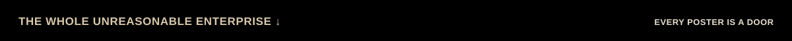

<a href="https://1puni.com/#openhelm">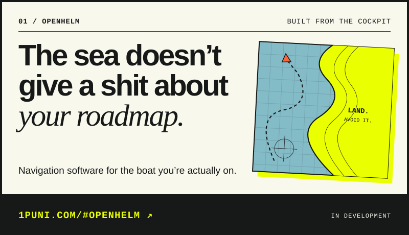</a>
<a href="https://1puni.com/cartography/">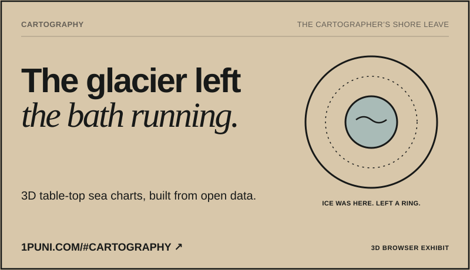</a>
<a href="https://1puni.com/#screensaver">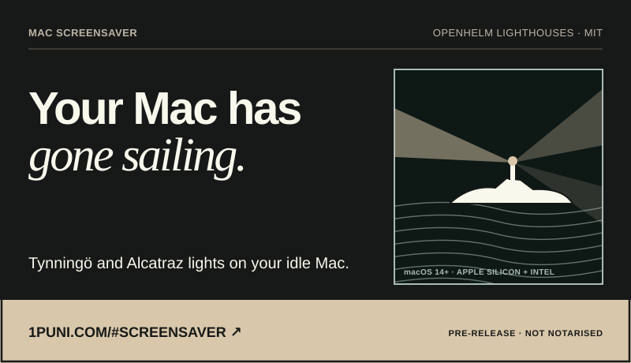</a>
<a href="https://bathy.1puni.com/">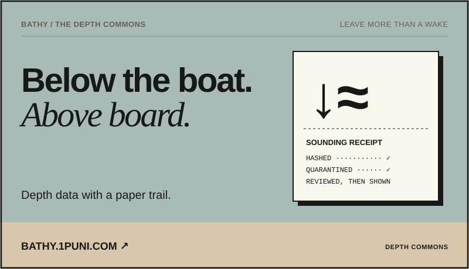</a>
<a href="https://crosstrees.1puni.com/">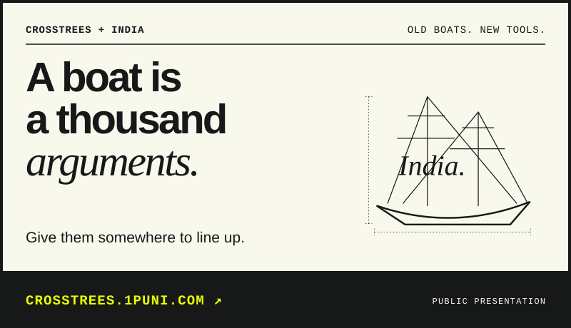</a>
<a href="https://1puni.com/autopilot/">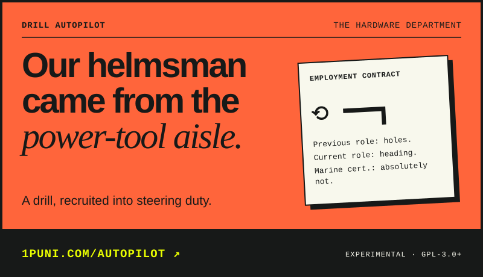</a>
<a href="https://overprint.1puni.com/">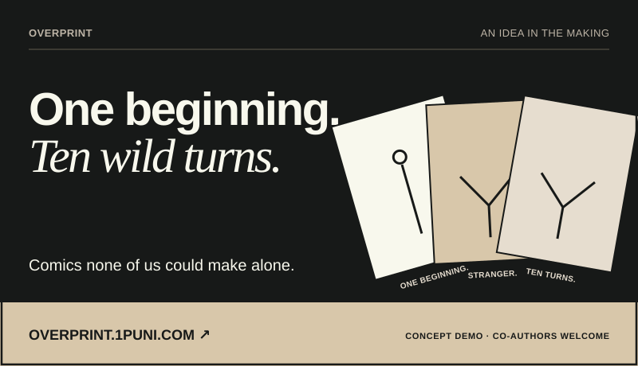</a>
<a href="https://1puni.com/#switchboard">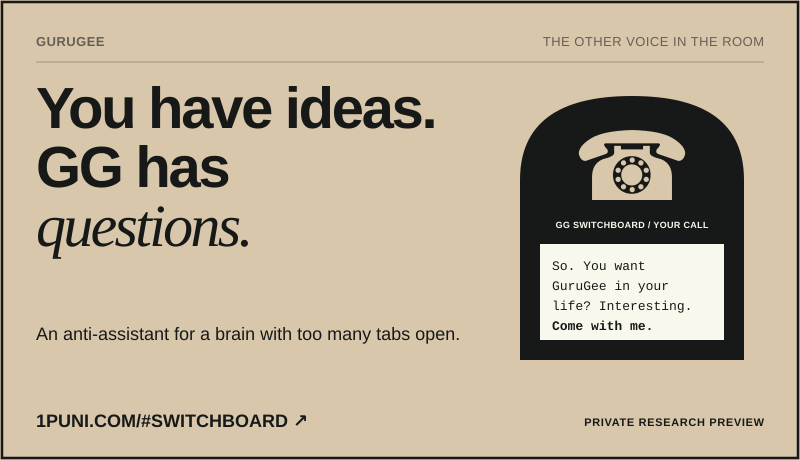</a>
<a href="https://glance.1puni.com/">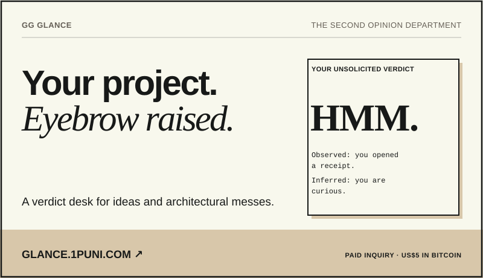</a>
<a href="https://github.com/1puni/steward">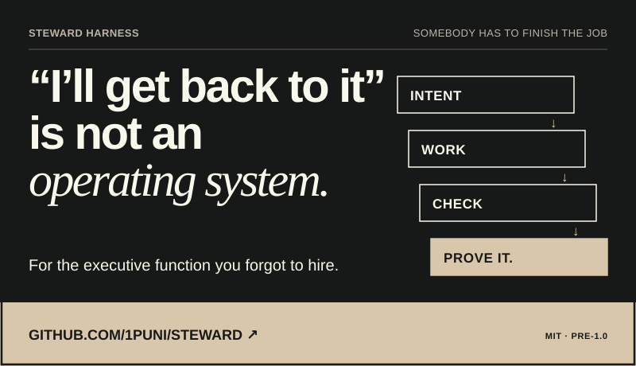</a>
<a href="https://allmanningen.fyi/">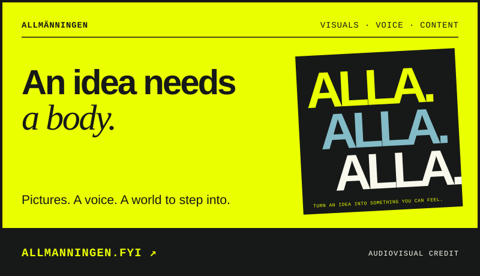</a>

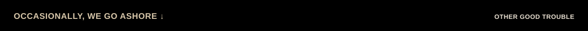

<a href="https://www.nsnodes.com/">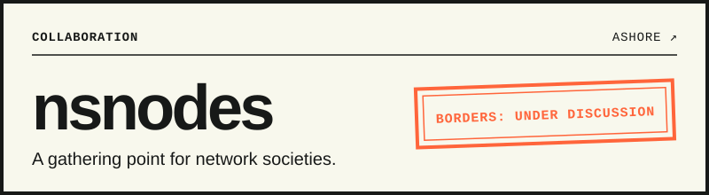</a>
<a href="https://llmpsych.com/">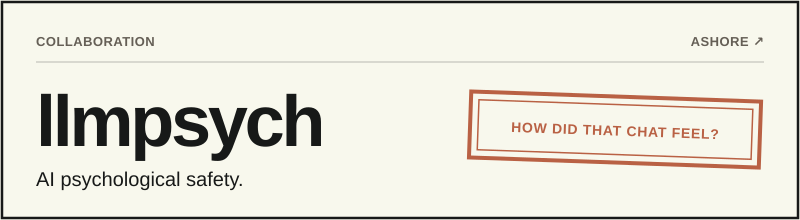</a>

<b><a href="https://originalcreation.se/">Original Creation</a> · Previous 1puni work · 2025–August 2026.</b> Show your workings. Product-provenance and compliance-pipeline engineering, informed by the EU’s direction on Digital Product Passports. Less magic. More evidence. Engineering work, not a certification or a guarantee of compliance.

<b><a href="https://allmanningen.fyi/">ALLMÄNNINGEN</a></b> proposes replacing Sweden’s government with commonly owned intelligence — a political proposal, not a system in office. 1puni’s contribution is the audiovisuals: visuals, voice and content.

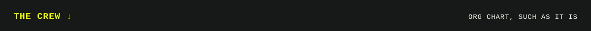

| | Crew | Job | Previously |
|:-:|---|---|---|
| 🍪 | **Cookie** | Founder, captain, entire workforce | Dry land |
| ⛵ | **Nike** | [Global headquarters](https://1puni.com/#top). Room for expansion. Has a bilge | 90 years of being a boat |
| 🪛 | **The drill** | [Helmsman](https://1puni.com/autopilot/) | Holes |
| ☎️ | **GG** | [The other voice in the room](https://1puni.com/#switchboard). Asks the awkward question | Never said “Certainly!” |
| 🧾 | **Steward** | [Finishes the job](https://github.com/1puni/steward) and keeps the receipts | “I’ll get back to it” |

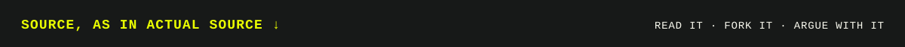

| Repo | What’s inside | Licence | Deep end |
|---|---|:-:|---|
| [**steward**](https://github.com/1puni/steward) | Git-native, provider-neutral repository stewardship. *The model proposes; the harness disposes.* | MIT | [Getting started →](https://github.com/1puni/steward/blob/main/docs/getting-started.md) |
| [**openhelm-screensaver**](https://github.com/1puni/openhelm-screensaver) | Native Mac chart screensaver: Tynningö in Stockholm and Alcatraz over NOAA San Francisco Bay | MIT | [Lighthouses release →](https://github.com/1puni/openhelm-screensaver/releases/tag/lighthouses-2026.09.29) |
| [**gps-only-pilot**](https://github.com/1puni/gps-only-pilot) | GPS-course autopilot for a Raspberry Pi and a drill-motor steering rig | GPL‑3.0+ | [The drill got promoted →](https://1puni.com/autopilot/) |
| [**meshtastic-firmware**](https://github.com/1puni/meshtastic-firmware/tree/nmea-udp-broadcast) | Meshtastic fork: T‑Deck Plus GNSS as NMEA over UDP, straight into the chartplotter | GPL‑3.0 | [The patch branch →](https://github.com/1puni/meshtastic-firmware/tree/nmea-udp-broadcast) |

<b>Like what’s taking shape? Send a little BTC our way.</b> Leave your email and we’ll write when there’s something worth sharing. The odd update. Maybe the odd surprise. — <a href="https://1puni.com/#support">1puni.com/#support</a>

A preview is a preview: statuses on the posters are the honest ones from <a href="https://1puni.com/">1puni.com</a>. Illustrations are illustrations. Fictional waters, please don’t navigate them.

<a href="https://1puni.com/">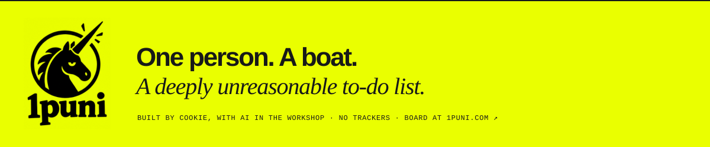</a>
